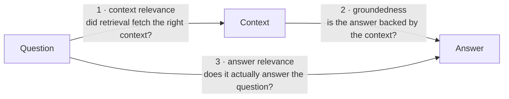

# rag-triad

> A small, local RAG evaluator that tells you **which of its own numbers you can actually trust.**

Retrieval-augmented answers fail in three different places — bad retrieval, hallucinated generation, or
an off-topic response. `rag-triad` scores all three (the **RAG triad**: context relevance, groundedness,
answer relevance) and, unusually, **localizes *which* one broke** — while being honest about which of its
verdicts are deterministic and which are just a model's opinion. Runs locally on
[Ollama](https://ollama.com); no API keys, no cloud, no dependencies beyond the standard library.

## See it in 10 seconds
```bash
ollama pull nomic-embed-text && ollama pull qwen2.5-coder:7b
python3 example.py
```
```
▸ grounded, on-topic answer
    Q: How long do I have to return an item?
    A: You can return an item within 30 days of purchase, as long as you have the receipt.
    context ✓ RELEVANT     grounded ✓ PASS    answer ✓ RELEVANT
    → TRUSTWORTHY — all three legs pass.

▸ fabricated citation
    A: The policy states you have 90 days to return any item, and no receipt is required.
    context ✓ RELEVANT     grounded ✗ FAIL    answer ✓ RELEVANT
    → HALLUCINATION — the model left the context. Fix generation or enforce cite-and-verify.

▸ answer from the wrong context
    Q: How do I reset my password?     (context is the returns policy)
    context ✗ IRRELEVANT   grounded ✗ FAIL    answer ✓ RELEVANT
    → RETRIEVAL MISS — the right context wasn't retrieved. Fix chunking / embeddings / top-k.
```
Same three answers, three *different diagnoses* — each pointing at a different part of your pipeline.

## The triad, and why "which leg" is the whole point

A single "is it good?" score can't tell a retrieval bug from a hallucination from an off-topic reply.
The triad can — **#1 fails → retrieval; #2 fails → generation; #3 fails → the prompt.**

## What makes it trustworthy (not just another triad)
The triad framing is standard ([TruLens](https://www.trulens.org/), [RAGAS](https://docs.ragas.io/)).
The contribution here is the **discipline** layered on top — every leg leans on a *deterministic*
signal, not the whim of a judge model:

- **Fail-closed groundedness.** The model must cite a quote; **code** — not the model — verifies the quote
  is really in the context. A fabricated citation can't pass as "grounded"; the worst case is an honest DEFER.
- **A deterministic corroborator matched to each leg's failure mode.** Context-relevance gets an
  embedding-similarity *floor* (a low value overrides a mistaken "relevant" judge); answer-relevance gets an
  answer-*type* gate (a question that demands a number/time the answer lacks isn't relevant). The judge legs
  sample N times and **abstain** rather than emit a confident-but-worthless score.
- **Validate the validator.** `--selftest` runs planted failures the evaluator must catch before you rely on
  it — a fabricated citation (must fail groundedness), an honest refusal (must NOT read as a hallucination).

## Quickstart
```bash
python3 example.py                 # the demo above
python3 rag_triad.py --selftest    # prove it catches planted failures (should print CALIBRATED: YES)
python3 rag_triad.py sample.json   # score one {"question","context","answer"} of your own
```
Env: `TRIAD_MODEL` (judge, default `llama3.2:3b`), `TRIAD_EMBED` (default `nomic-embed-text`),
`TRIAD_SAMPLES`, `TRIAD_RELEVANCE_FLOOR`.

📖 **The story & motivation:** [WRITEUP.md](WRITEUP.md) — why an evaluator should admit what it can't judge.
🔧 **Design rationale + honest limits:** [DESIGN.md](DESIGN.md).

## What it deliberately does NOT do
It doesn't pretend a judged number is certain. Groundedness is bankable (a deterministic gate); the
relevance legs are model-judged and will **abstain** when a small model can't be trusted. *Knowing which is
which* is the entire point — an evaluator that reports its own limits is worth more than one that hides them.

MIT © Melissa Ellison.
